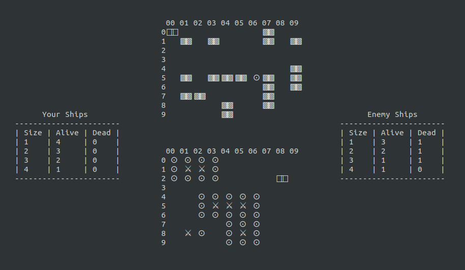

# Homework 1

## Морской бой

### Как играть 

#### Требования

Python 3.8+

Также перед запуском игры рекомендуется развернуть консоль на весь экран.

#### Запуск Игры

Нужно перейти в папку с игрой и запустить:

```
python3 battleships N K
```

где `N` и `K` натуральные числа больше 4, задающие высоту и ширину поля соответственно

#### Описание Игры

Игра выглядит следующим образом 



На верхнем поле указаны расположения ваших кораблей, там же будут отмечены выстрелы, сделанные ИИ.

Нижнее поле используется для обстрела вражеских кораблей.

Справа и слева от полей находятся таблицы, на которых можно увидеть, сколько кораблей какого размера осталось/уничтожено у вас и у противника. Если размеры полей большие и в игре присутствует больше 50 кораблей разных размеров, то данные таблицы отображаться не будут.

Поля реализованы как скользящие окна размера 10х10. Если N или K больше 10, то "скользите" в нужную сторону, используя кнопки навигации.

#### Управление

Активная клетка помечена курсором. Для смены положения курсора используйте кнопки навигации.

Навигация по верхнему полю: `w`, `a`, `s`, `d`

Навигация по нижнему полю: `стрелки`

Выстрел по активной клетке: `Enter`

Сохранение игры: `o`

Загрузить игру можно при запуске игры, выбрав соответствующую опцию в меню. Учтите, что если нет сохранений, то данная опция показана не будет. В настоящий момент можно сохранять только одну игру, следующие сохранения будут перезаписывать старые. Сохранения находятся в папке `/saves`


